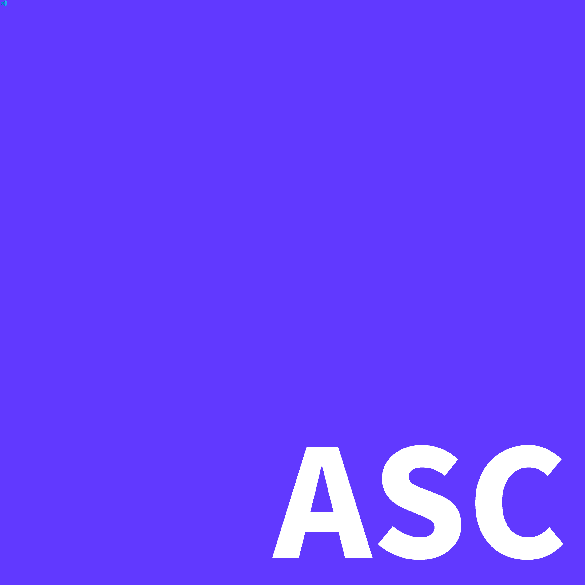

# 😄 Asanali Script (aScript) v1.0

 — это легкий, фановый и мощный скриптовый язык программирования, построенный на базе гибридной архитектуры (Python, JavaScript и элементы C). Он сочетает в себе простоту системных команд `.bat` файлов, гибкость Python и возможности веб-интерфейсов.

## Главные фичи
* **Встроенный движок окон:** Через команду `window()` можно мгновенно развернуть графический интерфейс с поддержкой HTML5, CSS (включая эффекты glassmorphism, `backdrop-blur`) и JavaScript.
* **Голосовой и тональный класс:** Блок `class sound` умеет озвучивать текст голосом робота и генерировать чистые звуковые частоты.
* **Работа с системой и БД:** Встроенные команды для поиска файлов по маске (`open`), работы с файлами (`join`) и встроенная база данных (`database`), которая автоматически связывает фронтенд в окне с бэкендом на ПК.

## пример кода (`index.asc/index.ascript`)

```TypeScript
/*
* AsanaliScript Example Code
* Like-typescript and like-bat script language (interpreter)
*/
let appName : string = "AsanaliScript Studio"
let version : number = 2.1
let isDevMode : boolean = true

let config = {
    theme: "dark",
    autoSave: true
}

show sys.info
echo Запуск приложения $appName (v$version)...
echo Текущий пользователь: $User

if $isDevMode == true {
    echo Режим разработчика активен.
} else {
    echo Запущено в продакшн режиме.
}

cli.args
join "system_log.txt" {
    write "Сессия $User успешно инициализирована в $appName."
}

class sound {
    echo "Система готова к работе"
    tone 440
    tone 880
}

window(
    <div style="font-family: sans-serif; padding: 20px; background: #0d1117; color: #c9d1d9; border-radius: 10px;">
        <h1 style="color: #58a6ff;">🚀 $appName v$version</h1>
        <p>Разработчик/Пользователь: <b>$User</b></p>
        <hr style="border-color: #30363d;" />
        
        <h3>Управление базой данных</h3>
        <button onclick="saveToDB('last_login', '$User')" style="background: #238636; color: white; border: none; padding: 8px 16px; border-radius: 6px; cursor: pointer;">
            Сохранить сессию в DB
        </button>
        <button onclick="getFromDB('last_login')" style="background: #1f6beb; color: white; border: none; padding: 8px 16px; border-radius: 6px; cursor: pointer; margin-left: 10px;">
            Проверить DB
        </button>

        <h3 style="margin-top: 20px;">Тест звука</h3>
        <button onclick="playBeep(523, 0.2)" style="background: #89b4fa; color: #11111b; border: none; padding: 8px 16px; border-radius: 6px; cursor: pointer;">
            🔊 Воспроизвести Beep (C5)
        </button>
    </div>
)
```

Некоторые функции:
---------------
| функция | значение |
--------- | ----------
| let | создаёт переменную |
| window() | создаёт стильное окно |
| echo | выводит текст на экран |
| show sys.info | показывает инфу о системе |
| /* */ | комментарий |
--------------
